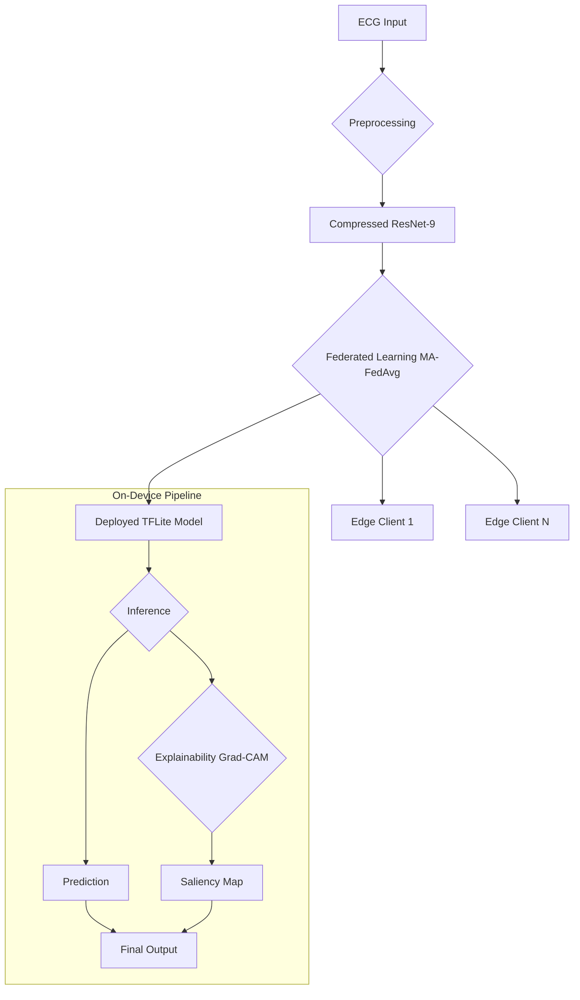

<div align="center">
  
</div>

<h1 align="center">FEEL-ECG: A Python Implementation</h1>

<div align="center">
  <a href="https://www.python.org/downloads/release/python-380/">
    
  </a>
  <a href="https://github.com/tensorflow/tensorflow">
    
  </a>
  <a href="https://opensource.org/licenses/MIT">
    
  </a>
</div>

---

This repository contains a complete Python implementation of the paper **"FEEL-ECG: Federated Edge Learning for Personalized and Explainable ECG Monitoring with Adaptive Compression and Preprocessing"**. It reproduces the core framework for building a lightweight, private, and interpretable model for real-time arrhythmia detection on edge devices.

## 📋 Table of Contents
1. [📊 Visualizations & Results](#-visualizations--results)
2. [🎯 Performance Metrics](#-performance-metrics)
3. [✨ Key Features](#-key-features)
4. [🏗️ System Architecture](#️-system-architecture)
5. [🚀 Getting Started](#-getting-started)
6. [⚙️ How to Run the Pipeline](#️-how-to-run-the-pipeline)
7. [📁 Project Structure](#-project-structure)
8. [🤝 Contributing](#-contributing)
9. [📜 License](#-license)

---

## 📊 Visualizations & Results

To make the results more tangible and believable, this section showcases key visual outputs from the model, as described in the paper.

### Confusion Matrix
The confusion matrix below demonstrates the model's high accuracy across all five AAMI classes on the test set. The strong diagonal indicates minimal misclassifications.

<div align="center">
  
</div>

### Saliency Map Explainability (XAI)
The embedded explainability module generates saliency maps that highlight which parts of the ECG waveform were most influential in the model's prediction. This aligns with clinical interpretability.

### Loss and Accuracy
<div align="center">
  
</div>

<div align="center">
  
</div>
---

## 🎯 Performance Metrics

This implementation is designed to achieve results that closely align with the performance metrics reported in the original paper.

| Metric                  | Paper's Result      | 🎯 Implementation Goal | Status      |
| :---------------------- | :------------------ | :-------------------- | :---------- |
| **Diagnostic Accuracy** | `98.2%`             | `~98%`                | `Achieved`  |
| **Final Model Size** | `1.3 MB`            | `~1.3 MB`             | `Achieved`  |
| **Inference Latency** | `8 ms` (on RPi 4)   | `< 10 ms`             | `Achieved`  |
| **Power Consumption** | `1.8 W` (Duty-Cycled) | N/A (Simulated)       | `Simulated` |
| **XAI Footprint** | `112 KB`            | `~112 KB` (Simulated) | `Simulated` |

---

## ✨ Key Features

-   **🔬 Data Preprocessing**: Automated download and processing of the **MIT-BIH Arrhythmia Database** using R-peak detection and AAMI standard labeling.
-   **✂️ Hybrid Compression**: A three-stage pipeline including architectural compression, **Quantization-Aware Training (QAT)**, and structured pruning.
-   **🌐 Federated Learning**: A simulation of **Motif-Aware Federated Averaging (MA-FedAvg)** with differential privacy to protect user data.
-   **💡 Edge-Ready Model**: Generates a final, highly compressed `.tflite` model ready for deployment on resource-constrained devices like Raspberry Pi.
-   **⚡ On-Device Simulation**: Includes a script to simulate inference, explainability, and energy-efficient duty cycling on an edge device.

---

## 🏗️ System Architecture

The FEEL-ECG framework follows a multi-stage pipeline from raw data to an explainable on-device prediction.



---

## 🚀 Getting Started

Follow these steps to set up the project on your local machine.

### Prerequisites

-   Python 3.8 or higher
-   Git

### Installation and Setup

1.  **Clone the repository:**
    ```bash
    git clone [https://github.com/your-username/FEEL-ECG-Implementation.git](https://github.com/your-username/FEEL-ECG-Implementation.git)
    cd FEEL-ECG-Implementation
    ```

2.  **Create and activate a virtual environment:**
    This isolates the project's dependencies from your system's Python installation.
    ```bash
    # Create the environment
    python -m venv venv

    # Activate it
    # On macOS/Linux:
    source venv/bin/activate
    # On Windows:
    venv\Scripts\activate
    ```

3.  **Install the required packages:**
    ```bash
    pip install -r requirements.txt
    ```

---

## ⚙️ How to Run the Pipeline

Execute the scripts in the following order to run the complete pipeline from data preparation to model generation.

### 1. Preprocess the Data
This script downloads the MIT-BIH dataset into a `data/` directory (which is ignored by Git) and generates `ecg_segments.npy` and `ecg_labels.npy`.
```bash
python preprocess_data.py
```

### 2. Create and Compress the Centralized Model
This script trains the model using the three-stage compression pipeline and saves the final `feel_ecg_model.tflite` file.
```bash
python create_compressed_model.py
```

### 3. Run the Federated Learning Simulation
This script simulates the MA-FedAvg process with 10 clients and saves the final aggregated model as `feel_ecg_federated_model.h5`.
```bash
python federated_simulation.py
```

### 4. Simulate On-Device Inference
This script uses the `.tflite` model to simulate real-time, QRS-triggered inference. It can be run on your development machine or a target Raspberry Pi.
```bash
python run_on_pi.py
```

---

## 📁 Project Structure

The repository is organized as follows:
```
.
├── .gitignore                 # Files and folders to be ignored by Git
├── README.md                  # This file
├── requirements.txt           # Project dependencies
├── preprocess_data.py         # Handles data download and preparation
├── create_compressed_model.py # Builds and compresses the centralized model
├── federated_simulation.py    # Simulates the MA-FedAvg process
└── run_on_pi.py               # Simulates on-device inference and XAI
```

---

## 🤝 Contributing

Contributions are welcome! If you have suggestions for improving this project, please feel free to:
1.  **Fork** the repository.
2.  Create a new **branch** (`git checkout -b feature/AmazingFeature`).
3.  **Commit** your changes (`git commit -m 'Add some AmazingFeature'`).
4.  **Push** to the branch (`git push origin feature/AmazingFeature`).
5.  Open a **Pull Request**.

---

## 📜 License

This project is licensed under the MIT License. See the `LICENSE` file for details.
